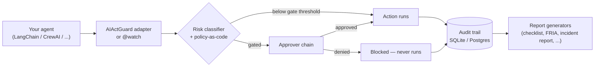

<div align="center">

# AIActGuard
### EU AI Act compliance middleware for agentic AI

**Drop-in, not a rewrite.**
Every open-source agent framework is well-served at the orchestration layer. None of them log a decision, gate a high-risk action, or draft the paperwork Articles 12–14 ask for — that gap is what this fills, as a decorator/callback around the agent you already have.

[](https://github.com/NavikkumarModi/AIActGuard/blob/main/LICENSE)
[](https://github.com/NavikkumarModi/AIActGuard/blob/main/pyproject.toml)
[](https://github.com/NavikkumarModi/AIActGuard/blob/main/.github/workflows/ci.yml)

[Install](#install) · [Quickstart](#quickstart) · [Why this exists](#why-this-exists) · [Module roadmap](#module-roadmap) · [Scope](#scope) · [Running the tests](#running-the-tests) · [Contributing](#contributing)

</div>

---


*Recorded from [examples/demo.py](https://github.com/NavikkumarModi/AIActGuard/blob/main/examples/demo.py) — real code, real gate decisions (one approval, one denial), real audit records, real report generated from both. The denial scenario shows LangChain's own internal warning when the callback raises — that's the block genuinely propagating through LangChain's real machinery, not this script claiming it worked. Two things are staged for the recording, not faked: the pacing between lines, and the approvers — canned functions playing the reviewer's role so the recording doesn't sit waiting on a keypress, not a live human typing an answer. See [examples/langchain_quickstart.py](https://github.com/NavikkumarModi/AIActGuard/blob/main/examples/langchain_quickstart.py) for the `input()`-driven version an actual reviewer would use.*

---

## Install

```bash
pip install aiactguard[langchain]
```

Other extras: `crewai`, `claude-agent-sdk`, `langgraph`, `autogen`, `openai-agents`, `postgres` (for `PostgresAuditStore`) — mix and match, e.g. `pip install aiactguard[langgraph,postgres]`.

Verify it installed correctly:

```bash
python -c "from aiactguard import watch; print('aiactguard OK')"
```

## Quickstart

```python
from aiactguard.adapters.langchain_adapter import AIActGuardCallbackHandler
from aiactguard.core.approval import ApprovalContext, ApprovalDecision


def compliance_officer(ctx: ApprovalContext) -> ApprovalDecision:
    approved = input(f"Approve {ctx.action} ({ctx.risk_tier.value})? [y/N] ").lower() == "y"
    return ApprovalDecision(approved=approved, approver_id="compliance_officer")


guard = AIActGuardCallbackHandler(
    category="essential_services",
    approvers=[compliance_officer],  # an escalation chain — add more to route to a fallback
)

agent_executor.invoke({"input": "..."}, config={"callbacks": [guard]})
```

See [examples/](https://github.com/NavikkumarModi/AIActGuard/tree/main/examples) for full runnable examples: [LangChain](https://github.com/NavikkumarModi/AIActGuard/blob/main/examples/langchain_quickstart.py), [CrewAI](https://github.com/NavikkumarModi/AIActGuard/blob/main/examples/crewai_quickstart.py), [Claude Agent SDK](https://github.com/NavikkumarModi/AIActGuard/blob/main/examples/claude_agent_sdk_quickstart.py), [LangGraph](https://github.com/NavikkumarModi/AIActGuard/blob/main/examples/langgraph_quickstart.py) (using LangGraph's own `interrupt()` for human-in-the-loop), [AutoGen](https://github.com/NavikkumarModi/AIActGuard/blob/main/examples/autogen_quickstart.py), [OpenAI Agents SDK](https://github.com/NavikkumarModi/AIActGuard/blob/main/examples/openai_agents_quickstart.py), the framework-agnostic [`@watch` decorator with an escalation chain + override](https://github.com/NavikkumarModi/AIActGuard/blob/main/examples/watch_with_escalation.py), [generating all five Phase 2 compliance reports](https://github.com/NavikkumarModi/AIActGuard/blob/main/examples/generate_reports.py) from an audit trail, [running the red-team scenario harness](https://github.com/NavikkumarModi/AIActGuard/blob/main/examples/red_team_scan.py), [a fairness scan](https://github.com/NavikkumarModi/AIActGuard/blob/main/examples/fairness_scan.py), [drafting an incident report + GPAI transparency card](https://github.com/NavikkumarModi/AIActGuard/blob/main/examples/incident_and_transparency_reports.py), [composite-system risk aggregation](https://github.com/NavikkumarModi/AIActGuard/blob/main/examples/composite_risk_pipeline.py), [NIST/ISO mappings](https://github.com/NavikkumarModi/AIActGuard/blob/main/examples/generate_mappings.py), [using the Postgres storage backend](https://github.com/NavikkumarModi/AIActGuard/blob/main/examples/postgres_backend.py), [a worked community plugin](https://github.com/NavikkumarModi/AIActGuard/blob/main/examples/plugins/example_gxp_plugin.py), and [the script that recorded the demo above](https://github.com/NavikkumarModi/AIActGuard/blob/main/examples/demo.py).

## Why this exists

The agentic AI ecosystem is saturated at the orchestration layer — LangChain, CrewAI, AutoGen, and the rest all do that job well. None of them were built to satisfy Article 12 (audit trails), Article 13 (explainability), or Article 14 (human oversight), because that isn't what they're for. AIActGuard sits *alongside* whichever of those you already run, not in place of it.



Every module drafts, flags, tests, or logs something concrete. None of them certify compliance on their own — that's a legal determination. See [Scope](#scope) below for the explicit boundary.

## Module roadmap

All 19 modules from the original project plan are built.

### Core (Phase 1)

| # | Module | Article(s) | What it does |
|---|---|---|---|
| 1 | Risk classification engine | Art. 6, Annex III | Tags each agent action/tool call against EU AI Act risk tiers using a configurable taxonomy across all eight Annex III high-risk categories |
| 2 | Immutable audit trail | Art. 12 | Every decision, tool call, input/output, model version, and timestamp logged to an append-only store — SQLite by default, [Postgres](https://github.com/NavikkumarModi/AIActGuard/blob/main/aiactguard/storage/postgres_store.py) for production |
| 3 | Human-in-the-loop approval gates | Art. 14 | Configurable interrupt points that pause execution before a high-risk action fires, with an escalation chain of approvers and reasoned-override logging |
| 4 | Explainability capture | Art. 13 | Structures the agent's chain-of-thought/tool-selection rationale into an auditor-readable format |
| 5 | Framework adapters | — | LangChain, CrewAI, Claude Agent SDK, LangGraph, AutoGen, OpenAI Agents SDK — all 6 |
| 6 | Policy-as-code | — | YAML rules defining what counts as high-risk for a given org and what triggers a human gate |

### Documentation & assessment tooling (Phase 2)

| # | Module | Article(s) | What it does |
|---|---|---|---|
| 7 | Technical documentation generator | Art. 11, Annex IV | Auto-drafts the Annex IV technical file from audit logs + a guided questionnaire |
| 8 | Conformity readiness checklist | Art. 43 | Gap-analysis against Annex IV/VI requirements — a pre-assessment aid, not the assessment itself |
| 9 | FRIA template generator | Art. 27 | Pre-fills a Fundamental Rights Impact Assessment draft from risk classification and deployment context |
| 10 | Post-market monitoring plan generator | Art. 72 | Monitoring plan template scaffolded from risk tier and logged incident categories |
| 11 | EU database registration data prep | Art. 71 | Auto-compiles the metadata the Art. 71 registration form requires — filing stays manual |

### Robustness & incident tooling (Phase 3)

| # | Module | Article(s) | What it does |
|---|---|---|---|
| 12 | Adversarial/red-team test harness | Art. 15 | Runs prompt-injection, jailbreak, and edge-case scenarios against your agent — heuristic detection, not semantic judgment |
| 13 | Bias & fairness scan | Art. 10 | Statistical checks on agent decisions across a caller-supplied protected-characteristic proxy, at runtime |
| 14 | Serious incident report drafter | Art. 73 | Turns a flagged incident into a structured draft for human review before filing |
| 15 | GPAI transparency card generator | Art. 53 | Auto-generates a model transparency summary from config + usage patterns |

### Multi-agent & multi-standard extensions (Phase 4 — differentiators)

| # | Module | What it does |
|---|---|---|
| 16 | Composite-system risk aggregation | Flags when multiple individually low-risk agents, composed into a pipeline, cross into high-risk territory as a system |
| 17 | NIST AI RMF mapping layer | Maps audit/risk data to NIST AI RMF's Govern/Map/Measure/Manage functions |
| 18 | ISO/IEC 42001 mapping layer | Maps the same data to ISO 42001 AI management system clauses |
| 19 | Plugin architecture for community modules | Defined interface for jurisdiction- or industry-specific community modules |

## Scope

> [!IMPORTANT]
> Explicitly out of scope, and why — this boundary is what makes the rest of this list credible instead of overreaching:
>
> - **Prohibited-practice determination (Title II)** — legal judgment call, not a runtime check
> - **Conformity assessment / CE marking itself** — requires formal procedures, sometimes a notified body; the toolkit preps evidence, it doesn't perform the assessment
> - **Quality management system (Art. 17)** — an organizational process, not code
> - **GPAI systemic-risk evaluation (Art. 55)** — applies to frontier model providers, not agent builders
> - **Actual legal filing/registration submission** — data prep is automated, submission is not

> [!NOTE]
> `classifier_confidence` (logged on every audit record) is rule-match strength from a keyword/category classifier, not a calibrated probability of true risk. This project doesn't have a trained model behind it, and doesn't claim to.

## Running the tests

```bash
git clone https://github.com/NavikkumarModi/AIActGuard.git
cd AIActGuard
python3 -m venv .venv
.venv/bin/pip install -e ".[langchain,crewai,claude-agent-sdk,langgraph,autogen,openai-agents,postgres,dev]"
.venv/bin/pytest -q
# 117 passed
```

`tests/test_postgres_store.py` needs a reachable Postgres database (`AIACTGUARD_TEST_POSTGRES_DSN`, defaults to `postgresql:///aiactguard_test`) — it skips cleanly if none is available rather than failing the suite; CI runs a real Postgres service so it's exercised there either way. See [CONTRIBUTING.md](https://github.com/NavikkumarModi/AIActGuard/blob/main/CONTRIBUTING.md) for the full setup and design principles.

## Contributing

Contributions are welcome, especially jurisdiction- or industry-specific modules. Open an issue to discuss before submitting a large PR.

**Writing a plugin:** implement `aiactguard.plugins.Plugin` — a `name`, a `description`, and a `generate(logger, *, questionnaire=None, **kwargs) -> str` method (the same shape every built-in report/mapping already has). See [examples/plugins/example_gxp_plugin.py](https://github.com/NavikkumarModi/AIActGuard/blob/main/examples/plugins/example_gxp_plugin.py) for a worked example. To publish one for others to auto-discover, register it under the `aiactguard.plugins` entry-point group in your own package's `pyproject.toml`:

```toml
[project.entry-points."aiactguard.plugins"]
gxp = "aiactguard_gxp_plugin:plugin"
```

Callers pick it up with `aiactguard.plugins.discover_entry_points()`.

## License

MIT — see [LICENSE](https://github.com/NavikkumarModi/AIActGuard/blob/main/LICENSE).
